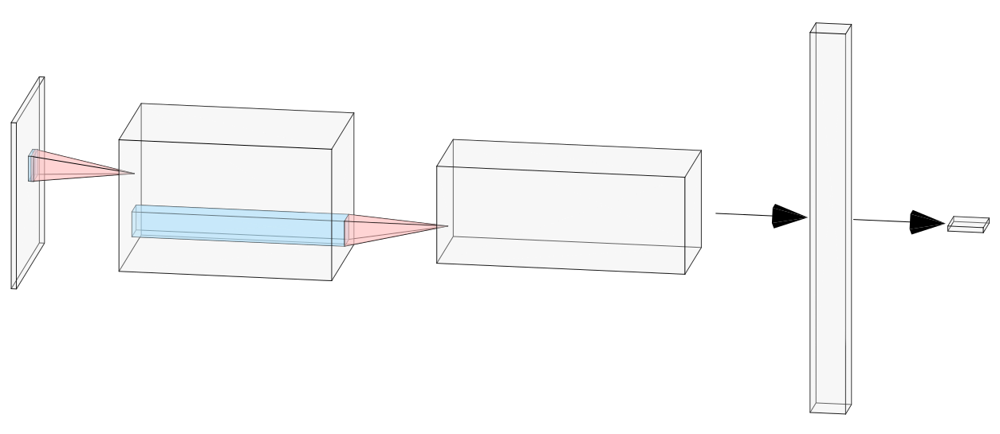
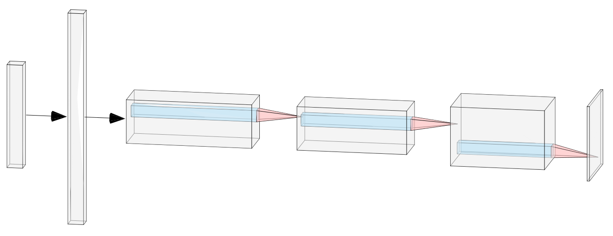
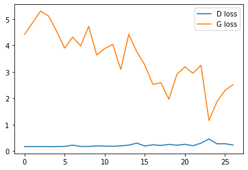
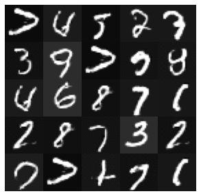

# Deep Convolutional Generative Adversarial Network

Ở [bài trước](../01.%20Introduction/README.md) chúng ta đã được giới thiệu về bài toán sinh ra chữ viết tay sử dụng mô hình GAN. Đây là một bài toán có dữ liệu là dạng hình ảnh, tuy nhiên bộ **Generator** và **Discriminator** đều đang sử dụng mạng neural thông thường. Với các bài toán dữ liệu hình ảnh thì kiến trúc mạng CNN ([Convolution Neural Network](https://en.wikipedia.org/wiki/Convolutional_neural_network)) đang được ưa chuộng và đã chứng minh hiệu quả của mình so với mạng neural truyền thống. Vậy có cách nào để kết hợp mô hình CNN với mô hình GAN không? Và hiệu quả của mô hình kết hợp đó như thế nào?

Câu trả lời chính là [Deep Convolutional Generative Adversarial Network - DCGAN](https://arxiv.org/abs/1511.06434). Về cơ bản DCGAN giữa nguyên kiến trúc của GAN gốc, chỉ thay đổi cấu tạo của bộ **Generator** và **Discriminator** từ mạng neural truyền thống sang sử dụng CNN


> Kiến trúc cơ bản của CNN (nguồn: https://en.wikipedia.org/wiki/Convolutional_neural_network)

Tiếp tục với ví dụ về sinh chữ viết tay ở [bài trước](), kiến trúc của bộ **Generator** và **Discriminator** sẽ trở thành như sau:

## Discriminator

Bộ Discriminator như thường lệ, là một bộ phân loại ảnh sử dụng CNN quen thuộc:



Bộ Discriminator nhận đầu vào là một ảnh có kích thước 1x28x28, đi qua 4 lớp convolution2d để phân loại. Đây là một mô hình CNN cơ bản nên mình sẽ không đi vào quá chi tiết phần này. Dưới đây là code cho bộ Discriminator:

```python
class Discriminator(nn.Module):
    def __init__(self):
        super(Discriminator, self).__init__()

        self.model = nn.Sequential(
            # input is 1 x 28 x 28

            nn.Conv2d(1, 32, 4, 2, 1, bias=False),
            nn.LeakyReLU(0.2, inplace=True),
            # state size. 32 x 14 x 14

            nn.Conv2d(32, 64, 4, 2, 1, bias=False),
            nn.BatchNorm2d(64),
            nn.LeakyReLU(0.2, inplace=True),
            # state size. 64) x 7 x 7

            nn.Conv2d(64, 128, 3, 2, 1, bias=False),
            nn.BatchNorm2d(128),
            nn.LeakyReLU(0.2, inplace=True),
            # state size. 128 x 4 x 4

            nn.Conv2d(128, 1, 4, 1, 0, bias=False),
            nn.Sigmoid()
        )

    def forward(self, img):
        output = self.model(img)
        return output.view(-1, 1)
```

## Generator

Bộ Generator thì hơi ngược lại với kiến trúc CNN thường thấy, khi nhận đầu vào là một vector 100 chiều, qua các lớp convolution để nhận lại được một ảnh có kích thước 1x28x28:



Dưới đây là code pytorch của bộ Generator:

```python
class Generator(nn.Module):
    def __init__(self):
        super(Generator, self).__init__()

        self.model = nn.Sequential(
            nn.ConvTranspose2d(latent_dim, 128, 4, 2, 0, bias=False),
            nn.BatchNorm2d(128),
            nn.ReLU(True),
            # state size. 128 x 4 x 4

            nn.ConvTranspose2d(128, 64, 3, 2, 1, bias=False),
            nn.BatchNorm2d(64),
            nn.ReLU(True),
            # state size. 64 x 7 x 7

            nn.ConvTranspose2d(64, 32, 4, 2, 1, bias=False),
            nn.BatchNorm2d(32),
            nn.ReLU(True),
            # state size. 32 x 14 x 14

            nn.ConvTranspose2d(32, 1, 4, 2, 1, bias=False),
            nn.Tanh()
            # state size. 1 x 28 x 28
        )

    def forward(self, z):
        z = z.view(*z.shape, 1, 1)
        img = self.model(z)
        return img
```

## Huấn luyện và kết quả

Quá trình huấn luyện DCGAN hiện tại hoàn toàn giữ nguyên những gì đã làm với GAN, đã được trình bày trong [bài trước](../01.%20Introduction/README.md#huấn-luyện-gan). Toàn bộ code trong tutorial này được cho tại [DCGAN.ipynb](DCGAN.ipynb), mọi người hoàn toàn có thể thử chạy trực tiếp trên [colab](https://colab.research.google.com/github/GafBof/GANs_torch/blob/dcgan/02.%20DCGAN/DCGAN.ipynb). Code của phần này mình có tham khảo từ repo [example của pytorch](https://github.com/pytorch/examples/tree/master/dcgan)



Kết quả thu được sau khi train 20 epoch cũng khá khả quan :heart_eyes:

|                        GAN                        |            DCGAN            |
| :-----------------------------------------------: | :-------------------------: |
|  |  |
